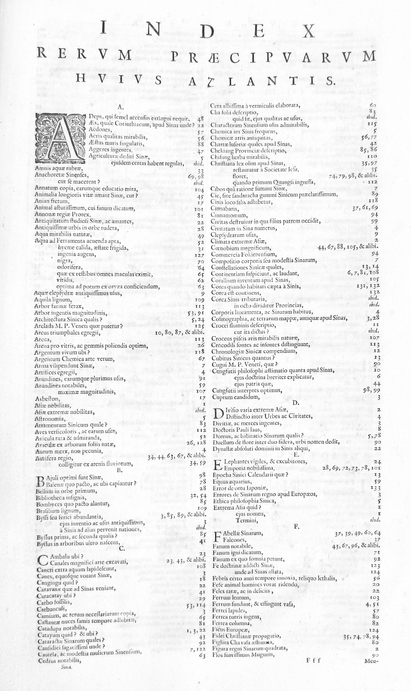
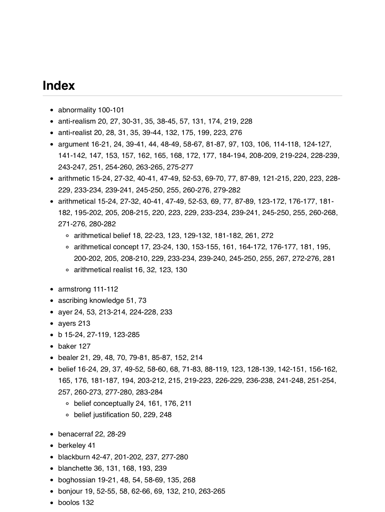

# index_generator

This is the result of my final project for the AllWomen DS bootcamp. The aim of this project was to explore whether it is possible to automatically generate the analytic index (sometimes called "back-of-the-book index") of academic book.

Analytic indices are typically found at the end of books and contain an alphabetized list of important concepts/names found in the book with references of the pages where they can be found. They also contain some information about relations of similarity between different keywords as well as lists of secondary keywords (deriving from a main keyword).

These indices are present in practically all academic books and they make their reading much easier while also providing a very exhaustive overview of their contents. Their development is, nevertheless, very time consuming and a rather tedious task (I know this first hand, since some years ago I was asked to make one: https://link.springer.com/book/10.1057/9781137472519), so it seems like it would be great to automatize it.

From the point of view of NLP, this is a keyword extraction problem. My approach was to treat it as a supervised binary classification task.

The idea was to create a dataset of candidate keywords, extract linguistic features from them (in some cases, relative to their context -- i.e. book, section, sentence), and try to predict whether they were supposed to go into the index based on these.

## Pipeline

My starting point were 22 books in pdf (all containing analytics indices). Their topics were varied, but predominantly about philosophy and linguistics (these were simply the books I had available).

1) **From PDF to text**. Output: the content of each book in txt format. 
2) **Text preprocessing**. Output: one dataset per book consisting of all the clean sentences and metadata for each sentence (page number, section…).
3) **Feature extraction**. Output: A single dataset where each line corresponds to a candidate keyword and the columns are characteristics of these keywords.
4) **Classification model**. Output: A trained classification model to predict if a candidate keyword should actually be in the index.
5) **Index generation**. Output: A formatted (and editable) draft analytic index for a given book.

## The final dataset

857000 candidate keywords / 10 linguistic features

The candidate keywords consisted of unigrams and bigrams (if I went beyond that, my personal computer couldn't handle the size of the dataset!) extracted after a relatively moderate cleaning process. The reason why the cleaning can not be too aggresive is that we risk missing out on potential index keywords.

The main part of my project was the extraction of the linguistic features. Some of them are simply motivated by an intuition on my part of what could be significant for appearing in an index (in part based on my own experience as an indexer). But a few of them I adopted from similar works (see Wu et al [2013], Koutropolou and Galloupoulos [2019]).

List of features:

- Part of speech
- Position in sentence
- Absolute frequency
- Does it appear in a section title?
- Does it appear as an author in the bibliography?
- Tf-Idf scores relative to the deepest available section nesting
- Importance: Cosine similarity between the sentence embedding and the whole book's embedding
- Length of the word
- Is it a typical textbook word?
- Is it a named entity?

Target variable: Is it in the index?

## Model

My final model was a XGBoost classifier. And my resulting metrics were:

| Metric| Value|
| ------------- |:-------------:|
| Accuracy       | 0.99          |
| Precision| 0.72 |
| Recall| 0.23|
| F1| 0.35|

Training the model with oversampling (SMOTE) gave a much better recall (trading off precision). This may be preferable if the resulting index is to serve a human indexer as a tool from which to extract the actual final index (since it's easier to remove keywords than to add them). 

| Metric| Value|
| ------------- |:-------------:|
|Accuracy| 0.97|
|Precision | 0.19|
|Recall | 0.62|
|F1 | 0.30|

However, this is only at the expense of introducing invented observations into our dataset as well as of higher computational costs.

Overall, I am realitvely satisfied with these results. Firstly, as far as I know, they are comparable with the metrics gotten by other attempts to automatize index generation, which tells me I'm not completely off track. 

More generally, it was to be expected that this task would be difficult to fully automatize. After all, it is a job that's difficult for us, humans, in the first place. To quote the Chicago Manual of Style:

>The ideal indexer sees the work as a whole, understands the emphasis of the various parts and their relation to the whole, and knows what readers of the particular work are likely to look for. The indexer should be widely read, scrupulous in handling detail, analytically minded and well acquainted with publishing practices.

It seems a lot to ask of an ML model. 

On top of the taask simply being complex, it is subjective. It is done by different people with different criteria. There are no strict standards or methods to produce an index. And, on top of that, the criteria change between different fields.

For example: technical books tend to omit author names, while humanities books tend to include them.

This final observation led me to consider the hypothesis that specialized models for different academic fields would do better than general models like the one I trained.

## A specialized model for philosophy books

To test this hypothesis (to a rather limited extent), I trained a model on a subset of the original set of books, consisting of 10 philosophy books.

The results were indeed considerably better:

| Metric| Value|
| ------------- |:-------------:|
|Accuracy| 0.99|
|Precision | 0.78|
|Recall | 0.37|
|F1 | 0.59|

## Final remarks

There are plenty of things to improve. After all, this work was done rather hastily, over a period of 6 weeks. If I had more time, I would work on the following:

- Go beyond extractive method: some of the words in analytic indices are not actually present in the body of books, but are generated by the indexer.
- Train model on bigger and more balanced dataset (i.e. balanced wrt the types of books included).
- Include trigrams as candidate keywords.
- Improve cleaning pipeline.
- Work on the processing of formalism from pdf to txt, since most mathematical symbols are lost in my implementation.

## Here's a capture of one of the indices generated by my programme:

